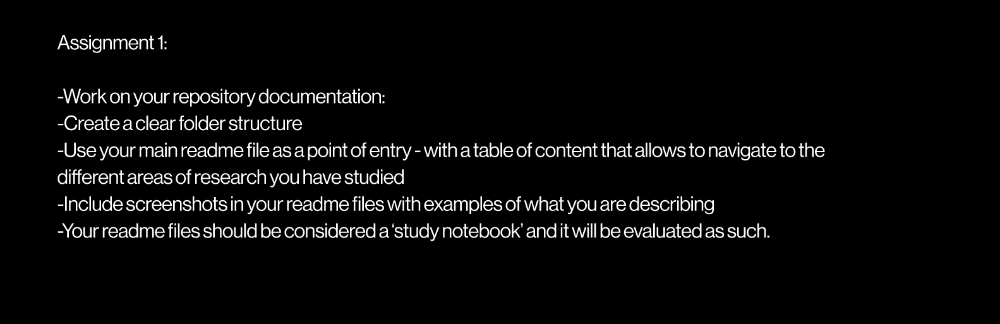

# Procedural World Building — Study Notebook

Coursework repository for **Procedural World Building** at Cornell AAP, Fall 2026.

This repository is both a working prototype and a study notebook. It records the questions, design decisions, implementation experiments, tutorials, and evaluations that lead toward a procedural world built inside giant trees.



## Table of Contents

| Area | Start here | Purpose |
| --- | --- | --- |
| Class notes | [`docs/class-notes/`](docs/class-notes/) | Weekly observations, assignment criteria, and technical takeaways |
| Planning | [`docs/planning/`](docs/planning/) | World concept, scope, priorities, and feature backlog |
| Tutorials | [`docs/tutorials/`](docs/tutorials/) | Reproducible setup and technique guides |
| Analysis | [`docs/analysis/`](docs/analysis/) | Comparisons, case studies, performance results, and post-mortems |
| Web prototype | [`react-practice/`](react-practice/) | Interactive React and Three.js experiments |
| Visual evidence | [`docs/assets/`](docs/assets/) | Screenshots referenced by the notebook |

## Current Prototype

The web prototype contains weekly study areas plus a project tab:

1. **Week 1 — Three.js exploration:** scene setup, geometry, lighting, materials, orbit controls, and a fading grid.
2. **Week 2 — Infinite noise map:** deterministic noise, terrain layers, map controls, and height-based materials.
3. **Week 3 / Class 04 — Voxel terrain:** 3D density fields, cubic voxels, sequential CSG, chunking, Marching Cubes, and performance comparisons.
4. **Project — Giant Tree City:** 1–8 seeded giant trees (default 3) from root to canopy, with portals cut through each trunk; chunked Marching Cubes generated in a Web Worker.


Read the full study note: [`docs/class-notes/week-3-voxel-terrain.md`](docs/class-notes/week-3-voxel-terrain.md).


Project progress note: [`docs/class-notes/project-01-giant-trees.md`](docs/class-notes/project-01-giant-trees.md).

## Project Direction

The current world concept is **A City Built Inside Giant Trees**. Roots become underground cities, trunks contain industrial districts, branches support villages, and the canopy creates a different climate zone.

- [Project design](docs/planning/project-design.md)
- [Feature backlog](docs/planning/backlog.md)
- [Weekly notes](docs/class-notes/weekly-notes.md)

## Run the Prototype

```bash
cd react-practice
npm install
cp .env.example .env.local
npm run dev
```

The Firebase values are required for Firebase initialization but no world data is saved yet. See the [Firebase setup tutorial](docs/tutorials/Firebase%20setup.md) for configuration details. Never commit `.env.local`.

## Repository Map

```text
Coursework-Cornell-AAP-IT/
├── README.md
├── docs/
│   ├── README.md
│   ├── class-notes/
│   ├── planning/
│   ├── tutorials/
│   ├── analysis/
│   └── assets/screenshots/
└── react-practice/
    ├── README.md
    ├── public/
    └── src/
        ├── components/
        ├── lib/
        └── utils/
```

## Documentation Conventions

- Every major folder has a README that explains what belongs there.
- Notes link back to their section index and to related implementation files.
- Screenshots are stored in `docs/assets/screenshots/` instead of scattered through the repository.
- Tutorials include a goal, prerequisites, exact steps, a result, and pitfalls.
- Analyses state evidence and a conclusion rather than only summarizing a technique.
- Generated voxel arrays, caches, build outputs, and local environment files are not committed.

## Tools

- **React + Vite** — interface and development environment
- **Three.js** — interactive 3D rendering
- **Firebase** — connected backend for future parameter-based world saving
- **Houdini, Unreal Engine 5, and Blender** — planned procedural authoring and presentation tools

## Author

**yw2785** · Cornell AAP · Fall 2026
