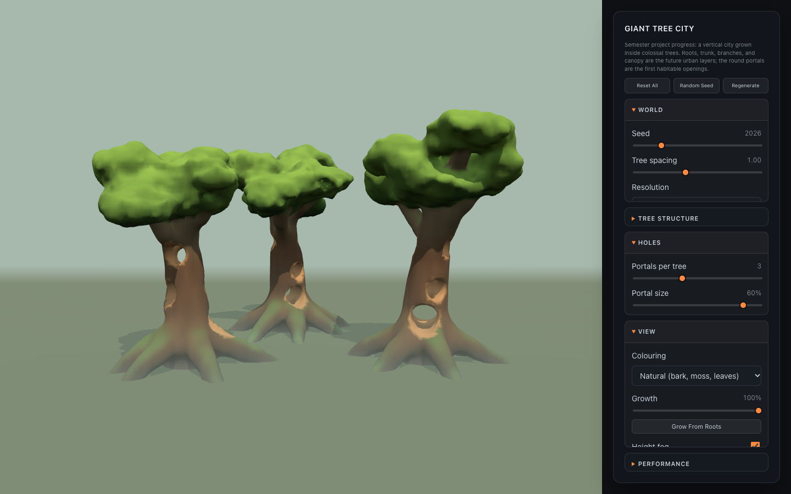
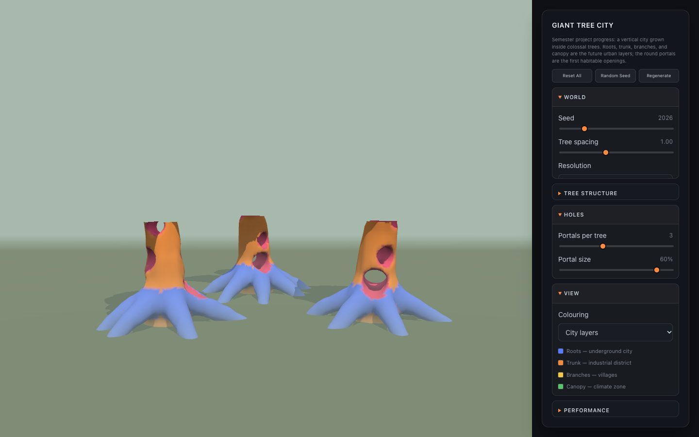

# Project Progress 01: Giant Tree World

[← Class-notes index](README.md) · [← Main README](../../README.md) · [Project design](../planning/project-design.md)

## Goal

First playable milestone for the semester project, **A City Built Inside Giant Trees**:

- Generate a world with **three giant trees**.
- Each tree must be complete **from root to top**: roots, trunk, branches, canopy.
- Leave **several holes inside each tree** as the first habitable spaces.

The result lives in the **Project** tab of the web prototype (`ProjectScene.jsx`).

## How the World Is Built

The pipeline reuses the Week 3 voxel ideas (density field, CSG, chunking, Marching Cubes) and scales them up from one small planet to three 60–75 m trees.

### 1. Tree blueprint (seeded)

`createWorldBlueprint()` in [`utils/giantTrees.js`](../../react-practice/src/utils/giantTrees.js) turns the parameters and one **world seed** into a list of signed-distance primitives per tree. Each tree gets its own seed, so the three trees differ but the same seed always rebuilds the same world.

| Layer    | Primitive                                   | Procedural choices                                                                                 |
| -------- | ------------------------------------------- | -------------------------------------------------------------------------------------------------- |
| Roots    | Tapered tubes along a Bézier curve          | Evenly spaced around the trunk with jitter; they arch above the ground, then dive below it         |
| Trunk    | Tapered tube through 8 wandering points     | Random lean and sine wobble; wide base, narrower crown                                             |
| Branches | Tapered tubes that curl upward              | Golden-angle azimuths so they never stack; each has one fork                                       |
| Canopy   | Squashed spheres (foliage pads)             | Clusters at every branch and fork tip, plus a crown                                                |
| Holes    | Horizontal round tunnels plus a hollow core | Spread from the root gate to about 60% of the height, stepped around the trunk by the golden angle |

### 2. Density and CSG

The density at a point is `-distance` to the tree surface (positive = solid, as in Week 3):

1. **Hard min inside a tube.** A root is several cone segments, and taking the plain minimum keeps it a clean tube.
2. **Smooth union between tubes.** `smoothMin` blends roots and branches into the trunk, which creates the flared buttresses.
3. **Noise.** 3D value noise (`utils/noise3d.js`) adds vertical bark ridges and broad lumps. Canopy pads get stronger fBm so they look leafy.
4. **Sequential subtraction.** Portals and the hollow core are subtracted last with `smoothMax`, which gives rounded rims.

### 3. Chunked Marching Cubes

The world is split into 16³-cell chunks (`planChunks`):

- **Culling.** A chunk that no primitive can reach is skipped before any sampling.
- **Per-chunk primitive lists.** Each chunk evaluates only the primitives near it, which makes sampling much cheaper.
- **Seamless meshing.** [`utils/chunkMesher.js`](../../react-practice/src/utils/chunkMesher.js) reuses three.js's Marching Cubes lookup tables but samples one extra ring of points around each chunk. That way normals on a chunk border match the neighbouring chunk and no cracks appear.
- **Web Worker.** [`workers/giantTreeWorker.js`](../../react-practice/src/workers/giantTreeWorker.js) generates the chunks off the main thread and streams them back **bottom to top**, so the trees visibly grow from the roots while generating.

### 4. Look and presentation

- **Natural colouring:** dark damp roots, warm trunk bark, lighter branches, moss on upward faces, sunlit leaves on top, and warm heartwood inside the portals.
- **City layers view:** colours each future urban layer (below).
- **Height fog:** a shader patch on `MeshStandardMaterial` makes fog thick at ground level and clear near the canopy, so each layer reads as a different climate.
- **Growth slider / Grow From Roots:** a clipping plane that reveals the trees from root to top.

## Bugs Found and Fixed

| Problem | Cause | Fix |
| --- | --- | --- |
| Thin cracks in the canopy | Chunks gathered primitives with a fixed margin smaller than blend radius + noise | Margins are now computed from the actual blend and noise sizes (`influenceMargins`) |
| Bulges and seam errors along roots | Smooth-min was applied between consecutive segments of the same tube, compounding at every joint | Hard min within a tube, smooth min only between tubes |
| Trunk cut in two | Two portals at the same height on different sides, plus bark dents, removed the whole cross-section | Portals shrink when crowded, are stepped by the golden angle, and bark only grows outward |
| Washed-out beige bark | sRGB colours written into a linear vertex-colour attribute | Convert to linear in `colorChunkVertices` |

Checked with a script over 30 seeds and the slider extremes: every trunk cross-section keeps at least ~18% solid wood, and neighbouring chunks agree to within 4 mm on shared faces.

## Performance (default seed, measured in Node)

| Resolution | Cell size | Density samples | Triangles | Generation time |
| --- | --- | --- | --- | --- |
| Low | 1.6 m | 0.95 M | 37 k | ~0.35 s |
| Medium | 1.1 m | 2.35 M | 80 k | ~0.7 s |
| High | 0.8 m | 4.98 M | 151 k | ~1.3 s |

Roughly half of the sampled chunks contain no surface, because they are either empty air or buried inside wood. Surface-aware chunk activation is a good next optimization.

## Next Steps

- Platforms, floors, and bridges inside the portals (the first "city" geometry).
- Emissive windows or lights on the heartwood walls.
- Different interiors per layer: underground root halls, industrial trunk shafts, branch villages.
- Firebase save/load for tree worlds (the current storage service is specific to Week 3).
- Terrain and rivers around the roots, instead of a flat ground plane.
