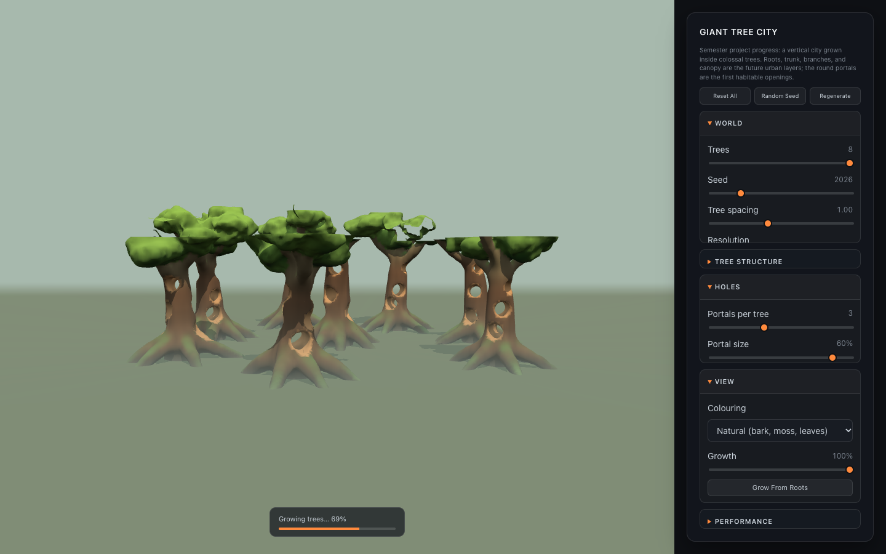
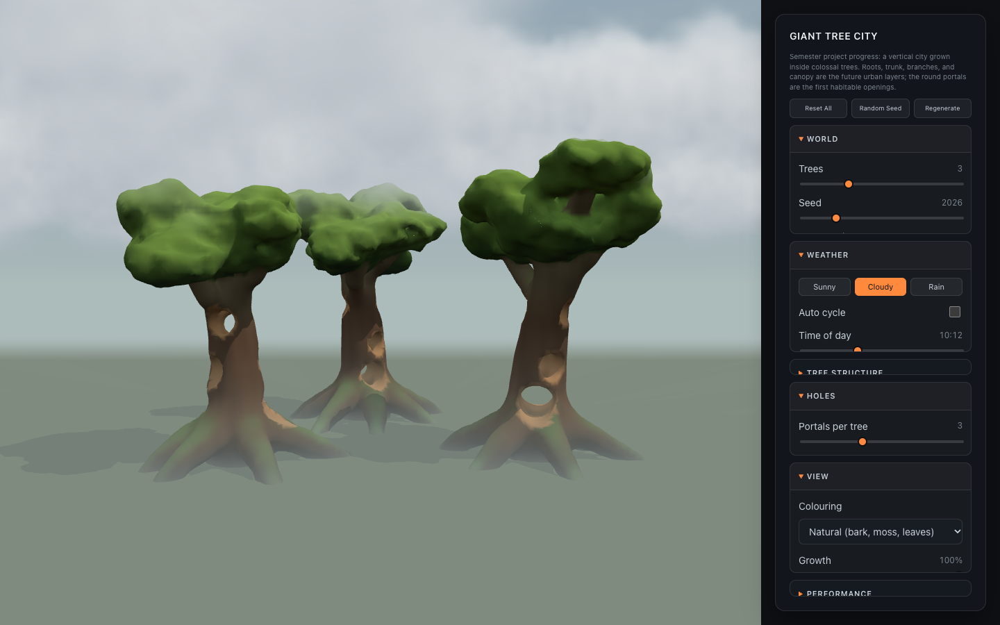

# Project Progress 01: Giant Tree World

[← Class-notes index](README.md) · [← Main README](../../README.md) · [Project design](../planning/project-design.md)

## Goal

First playable milestone for the semester project, **A City Built Inside Giant Trees**:

- Generate a world with **three giant trees**. *(Update: the user can now choose 1–8; see [Tree count](#tree-count).)*
- Each tree must be complete **from root to top**: roots, trunk, branches, canopy.
- Leave **several holes inside each tree** as the first habitable spaces.

The result lives in the **Project** tab of the web prototype (`ProjectScene.jsx`).

## How the World Is Built

The pipeline reuses the Week 3 voxel ideas (density field, CSG, chunking, Marching Cubes) and scales them up from one small planet to a forest of 60–75 m trees.

### 1. Tree blueprint (seeded)

`createWorldBlueprint()` in [`utils/giantTrees.js`](../../react-practice/src/utils/giantTrees.js) turns the parameters and one **world seed** into a list of signed-distance primitives per tree. Each tree gets its own seed, so the trees differ but the same seed always rebuilds the same world.

#### Tree count

The **Trees** slider (World section) sets how many trees grow, from 1 to 8 (default 3).

| Trees | Layout |
| --- | --- |
| 1 | One tree in the centre |
| 2–5 | A ring. It widens as trees are added so neighbouring trunks keep the same gap (about 1.07 × tree height) as the original three-tree layout |
| 6–8 | A centre tree inside a ring of the others, so the group reads as a forest instead of a hollow circle |

- **Same default world.** With 3 trees, every seed produces exactly the same world as before the slider existed.
- **No crowding.** Random wobble in each tree's angle shrinks on bigger rings. Across 20 seeds, the closest two trunks are always at least about 51 m apart, whatever the count.
- **The view follows the forest.** When the count changes, the camera moves in or out to frame all the trees. The shadow area and fog distance scale with the forest too. A new seed or other slider never moves the camera.

*Eight trees, captured while the canopies were still streaming in from the bottom up.*

| Layer    | Primitive                                   | Procedural choices                                                                                 |
| -------- | ------------------------------------------- | -------------------------------------------------------------------------------------------------- |
| Roots    | Tapered tubes along a Bézier curve          | Evenly spaced around the trunk with jitter; they arch above the ground, then dive below it         |
| Trunk    | Tapered tube through 8 wandering points     | Random lean and sine wobble; wide base, narrower crown                                             |
| Branches | Tapered tubes that curl upward              | Golden-angle azimuths so they never stack; each has one fork                                       |
| Canopy   | Squashed spheres (foliage pads)             | Clusters at every branch and fork tip, plus a crown                                                |
| Holes    | Horizontal round tunnels plus a hollow core | Spread from the root gate to about 60% of the height, stepped around the trunk by the golden angle |

### 2. Density and CSG

The density at a point is `-distance` to the tree surface (positive = solid, as in Week 3):

1. **Hard min inside a tube.** A root is several cone segments, and taking the plain minimum keeps it a clean tube.
2. **Smooth union between tubes.** `smoothMin` blends roots and branches into the trunk, which creates the flared buttresses.
3. **Noise.** 3D value noise (`utils/noise3d.js`) adds vertical bark ridges and broad lumps. Canopy pads get stronger fBm so they look leafy.
4. **Sequential subtraction.** Portals and the hollow core are subtracted last with `smoothMax`, which gives rounded rims.

### 3. Chunked Marching Cubes

The world is split into 16³-cell chunks (`planChunks`):

- **Culling.** A chunk that no primitive can reach is skipped before any sampling.
- **Per-chunk primitive lists.** Each chunk evaluates only the primitives near it, which makes sampling much cheaper.
- **Seamless meshing.** [`utils/chunkMesher.js`](../../react-practice/src/utils/chunkMesher.js) reuses three.js's Marching Cubes lookup tables but samples one extra ring of points around each chunk. That way normals on a chunk border match the neighbouring chunk and no cracks appear.
- **Web Worker.** [`workers/giantTreeWorker.js`](../../react-practice/src/workers/giantTreeWorker.js) generates the chunks off the main thread and streams them back **bottom to top**, so the trees visibly grow from the roots while generating.

### 4. Look and presentation

- **Natural colouring:** dark damp roots, warm trunk bark, lighter branches, moss on upward faces, sunlit leaves on top, and warm heartwood inside the portals.
- **City layers view:** colours each future urban layer (below).
- **Height fog:** a shader patch on `MeshStandardMaterial` makes fog thick at ground level and clear near the canopy, so each layer reads as a different climate.
- **Growth slider / Grow From Roots:** a clipping plane that reveals the trees from root to top.

## Weather

The **Weather** section of the panel adds sun, clouds, and rain. Weather only changes light and atmosphere, never geometry, so it never regenerates the trees.

| Sunny | Cloudy |
| --- | --- |
|  |  |
| **Rain** | **Sunset (Sunny, 17:10)** |
|  |  |

### Why weather matters for the concept

The concept says the canopy is "a completely different climate." Weather makes that visible:

- The cloud base drops as cover grows, so in rain the **treetops reach into the clouds** while the roots stay in mist.
- Rain darkens and wets the bark, and fog gathers at ground level: the **root city is damp and misty, the canopy is up in the weather**.

### Parameters

| Control | Range (default) | Meaning |
| --- | --- | --- |
| **Sunny / Cloudy / Rain** | presets (Sunny) | Set cloud cover, rain, and wind together. Changes blend smoothly over about 3 s. |
| **Auto cycle** | on / off (off) | Loops Sunny → Cloudy → Rain → Cloudy, 9 s each. Useful for a live demo. |
| **Time of day** | 06:00–18:00 (10:12) | Moves the sun from sunrise in the east, through noon, to sunset in the west. Low sun turns the light and horizon warm orange and makes long shadows. |
| **Cloud cover** | 0–100% (Sunny 18%, Cloudy 72%, Rain 100%) | How many cloud clusters appear. Heavier cover dims and greys the sun, softens shadows, and lowers the cloud base. |
| **Rain** | 0–100% (Rain 85%) | How many of the 40,000 raindrops fall. Rain also wets the bark and ground (darker, glossier) and thickens the mist. |
| **Wind** | 0–100% (Sunny 25%, Cloudy 45%, Rain 60%) | Speed at which clouds drift and how much the rain slants. |
| **Wind direction** | 0–359° (35°) | Which way the clouds drift and the rain leans. |

Editing Cloud cover, Rain, or Wind by hand switches the preset to "Custom" and stops Auto cycle.

### How it works

| Part | Technique |
| --- | --- |
| **Blending** | The panel sets a *target* weather; every frame the live weather eases toward it (exponential smoothing). Surfaces get wet in about 2.5 s but dry over about 9 s. |
| **Sun** | The existing shadow-casting sun moves along an arc set by time of day. Its colour shifts from white to orange near the horizon, and cloud cover and rain dim it. |
| **Sky** | A large inside-out sphere that follows the camera, shaded from horizon to zenith, with a sun disc and glow that fade behind clouds. The fog uses the horizon colour, so the ground melts into the sky. |
| **Clouds** | 56 clusters of 7 soft puffs each (392 camera-facing cards drawn in one call). Each puff's edge comes from noise in a shader. Cover fades clusters in by a random threshold, wind drifts them (wrapping at the field edge with a fade), and they are sorted back to front every frame so transparency layers correctly. |
| **Rain** | 40,000 streaks animated entirely in a vertex shader: each drop falls, drifts with the wind, and wraps inside a box that follows the camera, fading with distance. JavaScript only updates a few uniforms per frame. |
| **Wet surfaces** | The same shader patch that adds height fog also darkens the colour and lowers roughness by a wetness value, so bark and ground look wet. |

Code: [`weather/weatherState.js`](../../react-practice/src/weather/weatherState.js) (presets, blending, sun and sky colours), [`weather/sky.js`](../../react-practice/src/weather/sky.js), [`weather/clouds.js`](../../react-practice/src/weather/clouds.js), [`weather/rain.js`](../../react-practice/src/weather/rain.js).

### Tuning notes

The first rain looked too heavy: the cloud base dropped so low that whole canopies disappeared, and the fog washed out the middle tree. The cloud base now stops just above the tallest crowns (1.12 × tree height at full cover), and rain pulls the fog in less. The treetops touch the clouds but the trees keep their shape.

## Bugs Found and Fixed

| Problem | Cause | Fix |
| --- | --- | --- |
| Thin cracks in the canopy | Chunks gathered primitives with a fixed margin smaller than blend radius + noise | Margins are now computed from the actual blend and noise sizes (`influenceMargins`) |
| Bulges and seam errors along roots | Smooth-min was applied between consecutive segments of the same tube, compounding at every joint | Hard min within a tube, smooth min only between tubes |
| Trunk cut in two | Two portals at the same height on different sides, plus bark dents, removed the whole cross-section | Portals shrink when crowded, are stepped by the golden angle, and bark only grows outward |
| Washed-out beige bark | sRGB colours written into a linear vertex-colour attribute | Convert to linear in `colorChunkVertices` |

Checked with a script over 30 seeds and the slider extremes: every trunk cross-section keeps at least ~18% solid wood, and neighbouring chunks agree to within 4 mm on shared faces.

## Performance (default seed, measured in Node)

| Resolution | Cell size | Density samples | Triangles | Generation time |
| --- | --- | --- | --- | --- |
| Low | 1.6 m | 0.95 M | 37 k | ~0.35 s |
| Medium | 1.1 m | 2.35 M | 80 k | ~0.7 s |
| High | 0.8 m | 4.98 M | 151 k | ~1.3 s |

That table is for the default 3 trees. Cost grows roughly in proportion to the tree count:

| Trees | Resolution | Density samples | Triangles | Generation time |
| --- | --- | --- | --- | --- |
| 1 | Medium | 0.91 M | 22 k | ~0.23 s |
| 5 | Medium | 3.75 M | 133 k | ~1.1 s |
| 8 | Low | 2.26 M | 97 k | ~0.9 s |
| 8 | Medium | 5.91 M | 210 k | ~1.8 s |
| 8 | High | 12.27 M | 399 k | ~3.3 s |

For big forests on slower laptops, Low resolution keeps generation under a second.

Roughly half of the sampled chunks contain no surface, because they are either empty air or buried inside wood. Surface-aware chunk activation is a good next optimization.

## Next Steps

- Platforms, floors, and bridges inside the portals (the first "city" geometry).
- Emissive windows or lights on the heartwood walls.
- Different interiors per layer: underground root halls, industrial trunk shafts, branch villages.
- Firebase save/load for tree worlds (the current storage service is specific to Week 3).
- Terrain and rivers around the roots, instead of a flat ground plane.
- Weather extras: lightning and thunderstorms, rain blocked by the canopy (dry under the trees), puddles and splashes.
