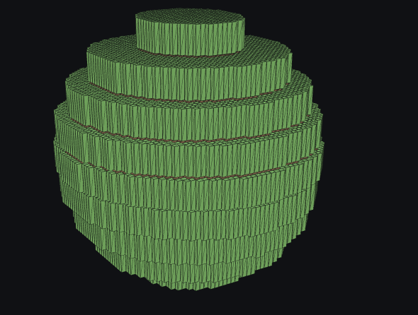

# Class 04: Voxel Terrain

[← Class-notes index](README.md) · [← Main README](../../README.md)

## Class Objectives and Criteria

The class asked us to:

- Create a voxel terrain in a separate tab.
- Explore and implement different density shapes.
- Explore Constructive Solid Geometry (CSG), especially sequential operations.
- Consider size and performance limitations and explain why chunking is needed.
- Implement a meshing solution such as Marching Cubes.
- Document alternative meshing techniques.
- Explore ways to optimize a voxel structure.

## Prototype Overview

We created a dedicated **Week 3: Voxel Terrain** tab in the React and Three.js prototype. `Week3Scene.jsx` contains its own 3D scene, density-field generator, voxel renderer, CSG system, chunking system, Marching Cubes mesh generator, optimization experiments, and control panel.

### Debugging the voxel proportions

At first, increasing the horizontal resolution to `100 × 100` made each voxel narrow in X and Z while its Y scale stayed at one world unit. The sphere was therefore assembled from tall rectangular prisms instead of cubes.



The fix uses one shared voxel step for X, Y, and Z. The vertical sample count is derived from that step, and distant-resolution voxels are coarsened on all three axes. The resulting planet is assembled from cubic voxels.


The terrain begins as a scalar density field:

- Positive density means **solid**.
- Zero or negative density means **empty space**.
- The voxel renderer places a cube wherever density is positive.
- Marching Cubes samples the same field and extracts a smooth triangle surface at the selected isovalue.

The prototype uses these world dimensions:

- Horizontal world extent: `17 × 17` units.
- Vertical world extent: approximately `12` units, beginning at `y = 0`.
- X, Y, and Z use the same voxel spacing; at horizontal resolution `100`, the field is approximately `100 × 70 × 100` samples.
- OrbitControls allow the user to rotate, pan, and zoom around the terrain.

The control panel is organized into five collapsible sections:

1. Terrain / Density
2. CSG
3. Chunking, including an Optimization subsection
4. Meshing
5. Performance

## Terrain / Density

### What a density field is

A density field assigns a number to every sampled point `(x, y, z)`. The sign of that number determines whether the point is inside or outside the terrain. This makes the world more flexible than a simple height map because density can describe caves, floating objects, planets, and other fully three-dimensional forms.

### Density Shape

The **Density Shape** dropdown selects the formula used by `sampleBaseDensity()`.

#### Ground Plane

Uses the height-field formula:

```text
density = h(x, z) - y
```

Points below `h(x, z)` are solid and points above it are empty. The height combines several sine waves and optional 2D fBm noise.

#### 3D fBm

Creates a volumetric field from layered noise. The prototype approximates 3D noise by averaging noise sampled on the `XY`, `YZ`, and `ZX` planes. A bounding box prevents the field from continuing infinitely.

#### Ridged 3D

Uses the absolute value of the 3D noise:

```text
density = 0.08 - abs(noise)
```

The solid region forms near the noise field's zero crossings, producing thin ridges and interconnected forms.

#### Terraced

Quantizes the terrain height into steps:

```text
steppedHeight = floor(height / terraceHeight) × terraceHeight
density = steppedHeight - y
```

This creates contour-like plateaus instead of a continuously smooth slope.

#### Floating Islands

Combines:

- A 2D noise mask that decides where islands exist.
- A height band that positions them vertically.
- Vertical falloff that controls their thickness.
- An edge boundary that keeps them inside the world.

#### Planet

Uses distance from a center point:

```text
density = radius + surfaceNoise - distanceFromCenter
```

Positive density creates a sphere whose surface is displaced by noise.

#### Strata

Uses a sine function through the vertical axis to generate repeated layers. 3D noise distorts the layers so that they are not perfectly horizontal.

### Terrain parameters

**Voxel resolution**

- Controls the number of horizontal samples and indirectly determines the vertical sample count.
- Range: `10–100`, in steps of `2`.
- Higher resolution creates smaller voxels and more detail while preserving the same physical world size.
- Increasing it also increases X, Y, and Z sampling, so generation and rendering cost rise quickly.

**Show voxel grid**

- Toggles the dark wireframe drawn over each voxel.
- This makes the individual cubes and current resolution easier to understand.

**Terrain height**

- Controls the strength of the analytic sine-wave terrain.
- Available for Ground Plane and Terraced shapes.

**Ground level**

- Moves the base height of height-field terrain up or down.

### Shape-specific parameters

**Terrace height / step size**

- Controls the vertical distance between terrace levels.
- Larger values create taller, fewer steps.

**Vertical falloff**

- Controls how quickly a floating island becomes empty above and below its center.
- Higher values make thinner islands.

**Island height band**

- Controls the main elevation at which floating islands appear.

**Planet radius**

- Controls the base size of the spherical planet.

**Layer frequency**

- Controls how frequently strata layers repeat.
- Higher values create more closely spaced layers.

**Distortion**

- Controls how strongly 3D noise bends the strata.

### Noise parameters

**Use Noise**

- Enables or disables fBm displacement for the Ground Plane.
- Other volumetric density shapes require noise and therefore always expose their relevant noise settings.

**Noise scale**

- Controls the spatial size of noise features.
- A smaller scale gives broad landforms; a larger scale changes more rapidly across space.

**Noise amplitude**

- Controls how strongly noise changes the terrain or surface.

**Octaves**

- The number of noise layers combined in fBm.
- Each additional octave adds finer detail but requires more noise calculations.

**Persistence**

- Controls how quickly octave amplitudes decrease.
- Higher persistence keeps small details stronger.

**Lacunarity**

- Controls how quickly frequency increases between octaves.
- Higher lacunarity separates each octave into much finer scales.

**Seed**

- Deterministically changes the noise pattern.
- The same seed and parameters always reproduce the same world.

## CSG

### What CSG means

**Constructive Solid Geometry** combines simple signed-density shapes using boolean-like operations. Unlike editing only the rendered cubes, CSG modifies the density field itself. This means both the voxel renderer and Marching Cubes receive the same edited terrain.

### Sequential evaluation

Enabled operations are stored in an ordered array and evaluated from top to bottom. Because every operation receives the result of the previous operation, changing the order can change the final terrain.

The user can:

- Add an operation.
- Remove an operation.
- Move an operation up or down.
- Enable or disable an individual operation.
- Clear the complete operation list.

### Operation parameters

**Operation**

- **Union:** adds the selected shape to the current density.
- **Subtraction:** removes the shape and creates an opening.
- **Intersection:** keeps only the volume shared by the terrain and the shape.

**Shape**

- **Sphere:** distance from a center point.
- **Box:** maximum distance along the local X, Y, and Z axes.
- **Capsule:** distance from a vertical line segment with rounded ends.

**Position X, Y, Z**

- Moves the operation through the world.

**Size / Radius**

- Controls the radius of a sphere, the half-size of a box, or the overall size of a capsule.

**Smoothness**

- Blends the operation into the existing density instead of creating a mathematically hard edge.
- `0` produces a hard operation.
- Larger values produce a softer transition.

**Show CSG Gizmo**

- Displays a colored wireframe preview of every enabled shape.
- Green represents Union, red represents Subtraction, and purple represents Intersection.

### CSG presets

**Cave Room**

- Appends one smooth subtraction sphere to make a chamber.

**Tunnel**

- Appends three overlapping subtraction spheres along the X axis.

**Arch**

- Appends a subtraction box followed by a subtraction sphere to form a rectangular opening with a rounded top.

**Rock Addition**

- Appends a smooth union sphere that adds mass to the terrain.

The generated preset operations remain editable after they are added.

## Chunking

### Why chunking is needed

A single large voxel volume becomes expensive because every change may require the whole field and all render instances to be rebuilt. Chunking divides the world into smaller independent regions so that a system can:

- Render only nearby chunks.
- Skip empty chunks.
- Rebuild only changed data.
- Apply lower detail to distant chunks.
- Display and measure smaller rendering workloads.

In this prototype, each active chunk receives its own `THREE.InstancedMesh`.

### Chunking parameters

**Enable Chunking**

- Switches between one complete voxel volume and multiple independently rendered chunks.

**Chunk size**

- Controls how many X/Z voxel columns belong to one chunk.
- Smaller chunks create more regions and finer control, but also more objects and management overhead.
- Larger chunks reduce object count but make each update affect a larger area.

**Active chunk radius**

- Controls how many chunks around the center chunk remain active.
- A radius of `0` keeps only the center chunk.

**Show chunk boundaries**

- Draws orange bounding boxes around active chunks.
- This makes the difference between one volume and multiple regions visible.

**Active chunk count**

- Shows how many chunks are currently represented.

### Optimization

The Optimization subsection is kept inside Chunking so that the panel still has five primary sections.

**Skip empty chunks**

- Avoids creating chunk records and boundaries for regions with no solid voxels.

**Regenerate only dirty chunks**

- Reuses the sampled density field when density-related parameters have not changed.
- In the current prototype this is a whole-field cache, not true per-chunk dirty tracking.

**Frustum / distance-based chunk activation**

- Uses distance from the world-center chunk and the active chunk radius to exclude distant regions.
- A true camera-frustum test is not implemented yet.

**Reduced resolution for distant chunks**

- Combines distant `2 × 2` voxel columns into larger render instances.
- The center chunk remains at full detail.
- This demonstrates level of detail (LOD) and lowers instance count, although it is still a simplified prototype.

### Before/after statistics

The Optimization panel reports:

- Theoretical chunk workload compared with active chunks.
- Original solid voxel instances compared with rendered instances.
- Percentage reduction in instances.
- Whether density sampling was rebuilt or reused.
- Latest generation time.

## Meshing

### What a mesh is

A mesh is a 3D surface made from connected triangles. Voxels represent the world as cubes, while meshing converts the density boundary into a continuous surface.

### Meshing Method

#### Marching Cubes

Marching Cubes is the implemented method and the default option. It:

1. Samples density on a uniform 3D grid.
2. Examines where values cross the isovalue.
3. Looks up the triangle pattern for each crossing cell.
4. Combines those triangles into a smooth surface.

It produces rounded organic terrain but does not preserve sharp corners well.

#### Surface Nets

Surface Nets is currently comparison-only.

- Expected appearance: smooth surfaces with simpler polygon flow.
- Polygon cost: usually lower than Marching Cubes.
- Sharp feature support: limited to moderate.
- Relative performance: fast.

#### Dual Contouring

Dual Contouring is currently comparison-only.

- Expected appearance: clean surfaces that can preserve hard edges.
- Polygon cost: medium and often efficient.
- Sharp feature support: strong.
- Relative performance: slower because it solves feature positions.

Selecting Surface Nets or Dual Contouring shows the comparison panel but does not generate geometry.

### Meshing parameters

**Enable Meshing**

- Generates a Marching Cubes surface.
- It is disabled for comparison-only methods.

**Display mode**

- **Voxels:** displays only the cubes.
- **Mesh:** displays only the generated triangle surface.
- **Both:** overlays the semi-transparent mesh on the voxel terrain for comparison.

**Isovalue**

- The density threshold where the surface is generated.
- The default is `0`, which matches the boundary between positive solid density and negative empty density.
- Changing it expands or contracts the generated surface.

**Grid resolution**

- Controls how many samples Marching Cubes evaluates in each dimension.
- Higher values create a more detailed surface but require substantially more density samples.

**Smooth shading**

- Blends lighting normals across neighboring triangles.
- Turning it off makes individual triangle faces more visible.

**Show wireframe**

- Displays the triangle edges of the generated mesh.
- This helps explain that the smooth-looking surface is still constructed from triangles.

### Mesh statistics

**Vertex count**

- Number of generated, non-indexed Marching Cubes vertices.

**Triangle count**

- Vertex count divided by three.

## Performance

### Resolution presets

**Low**

- Voxel resolution: `12 × 12`.
- Mesh grid: `16³`.
- Fastest but least detailed.

**Medium**

- Voxel resolution: `18 × 18`.
- Mesh grid: `24³`.
- Default balance between quality and performance.

**High**

- Voxel resolution: `24 × 24`.
- Mesh grid: `36³`.
- Most detailed and most computationally expensive.

All presets preserve the same world extent, seed, and density parameters so their visual and timing results remain comparable.

### Performance statistics

The section displays:

- Density-field dimensions.
- Rendered voxel count.
- Active chunk count.
- Mesh vertex count.
- Mesh triangle count.
- Generation time in milliseconds.

The displayed voxel count is the final rendered instance count after chunk activation and distant LOD. It may therefore be lower than the number of solid samples in the full field.

## Panel Actions and Presentation

**Reset All**

- Restores every parameter and operation to its default value.
- Clears the density cache and regenerates the world.

**Randomize Seed**

- Chooses a new seed from `0–9999`.
- The terrain updates immediately.

**Regenerate**

- Clears cached density data and forces the voxel field and mesh to rebuild using the current parameters.

Short hover tooltips explain Density, Seed, Octaves, CSG, Isovalue, Chunk size, and Marching Cubes. Each open section has its own scrollbar so the panel remains compact and the 3D world stays visually dominant.

## Technical Implementation

### Scene setup

The component creates:

- A Three.js scene with a dark background.
- A perspective camera.
- A WebGL renderer with device pixel ratio capped at `2`.
- OrbitControls with damping.
- Ambient, hemisphere, and directional lights.

### Voxel generation

`buildVoxelField()`:

1. Samples density into a `Float32Array`.
2. Tests each solid cell's six neighbors.
3. Marks a voxel as a surface voxel if any neighbor is empty.
4. Stores the voxel's world position and grid index.

Surface voxels receive a grass color and internal voxels receive a dirt color.

### Reactive updates

React effects rebuild:

- Voxel and chunk instances.
- The Marching Cubes mesh.
- CSG gizmos.

The `Regenerate` button increments a separate version value so the effects run even when no parameter changed.

### Shared density source

Voxels and Marching Cubes both call `sampleDensity()`. As a result, changing a density shape, seed, or CSG operation affects both representations consistently.

## Criteria Evaluation

### 1. Create a voxel terrain in a different tab

**Met.** Week 3 has a separate **Voxel Terrain** tab and a dedicated `Week3Scene` component.

### 2. Explore and implement different density shapes

**Met.** The prototype implements Ground Plane, 3D fBm, Ridged 3D, Terraced, Floating Islands, Planet, and Strata. Shape-specific parameters appear conditionally.

### 3. Explore and understand sequential CSG techniques

**Met.** Multiple operations can be added, removed, enabled, reordered, and evaluated sequentially. Presets demonstrate multi-operation constructions such as tunnels and arches.

### 4. Consider size and performance limitations and explain chunking

**Met for the prototype scope.** Chunk size, active radius, boundaries, active-chunk count, and before/after statistics demonstrate why dividing a large field into smaller regions is useful.

### 5. Implement a meshing solution such as Marching Cubes

**Met.** Marching Cubes samples the same density and CSG field and produces an adjustable triangle mesh.

### 6. Document alternative meshing techniques

**Met.** Surface Nets and Dual Contouring are documented through a comparison panel covering appearance, polygon cost, sharp-feature support, and relative performance. They are clearly marked as comparison-only.

### 7. Explore ways to optimize a voxel structure

**Met for the prototype scope.** The project demonstrates empty-chunk skipping, density caching, distance-based chunk activation, coarse distant LOD, resolution presets, and measured workload statistics.

## Limitations and Next Steps

- Dirty-chunk regeneration currently caches the whole density field rather than invalidating individual chunks.
- Distance activation is centered on the world, not the camera.
- Camera-frustum culling is not implemented.
- Distant LOD combines render instances but does not reduce density sampling.
- Surface Nets and Dual Contouring are documented but not implemented.
- CSG uses signed-density blending rather than exact boolean operations on polygon meshes.
- High horizontal resolution now increases the vertical resolution too, which preserves cubic voxels but raises the total sample count.
- Marching Cubes uses a separate cubic sample grid and can become expensive at high resolution.
- The Marching Cubes polygon buffer is capped at `100,000` polygons.
- The first Firebase integration can save and load parameter-only world configurations, but authentication and a saved-world browser still need to be added.

Useful next steps would be true per-chunk dirty flags, camera-based streaming, frustum culling, seamless chunk-border meshing, worker-thread generation, and implementation of Surface Nets or Dual Contouring.

## Why I Built This

- **Height maps cannot make hollow trees.** Week 2's terrain stores one height per point, so it cannot represent caves, overhangs, or a hollow trunk. A 3D density field can, which the Giant Tree City needs for roots that arch, portals, and interiors.
- **CSG is how the city is carved.** Adding and subtracting shapes in order is the same method the Project tab uses to blend roots and branches into the trunk and to cut the portals.
- **Chunking and meshing make it scale.** Three 60–75 m trees are far larger than this planet. The chunking and Marching Cubes studied here became the Project tab's chunked mesher. Two of the next steps above were built there: seamless chunk borders and worker-thread generation. See [Project Progress 01](project-01-giant-trees.md).

## Key Takeaways

- A density field separates the world definition from its visual representation.
- Voxels are simple and easy to inspect, but their cost grows quickly with resolution.
- Ordered CSG operations provide an editable way to add and remove density.
- Chunking creates the structure needed for culling, partial rebuilding, and level of detail.
- Marching Cubes converts block-based density samples into a smooth triangle surface.
- Different meshing methods make different trade-offs between smoothness, polygon count, sharp features, and speed.
- Live counts and timing make quality/performance trade-offs visible instead of purely theoretical.
