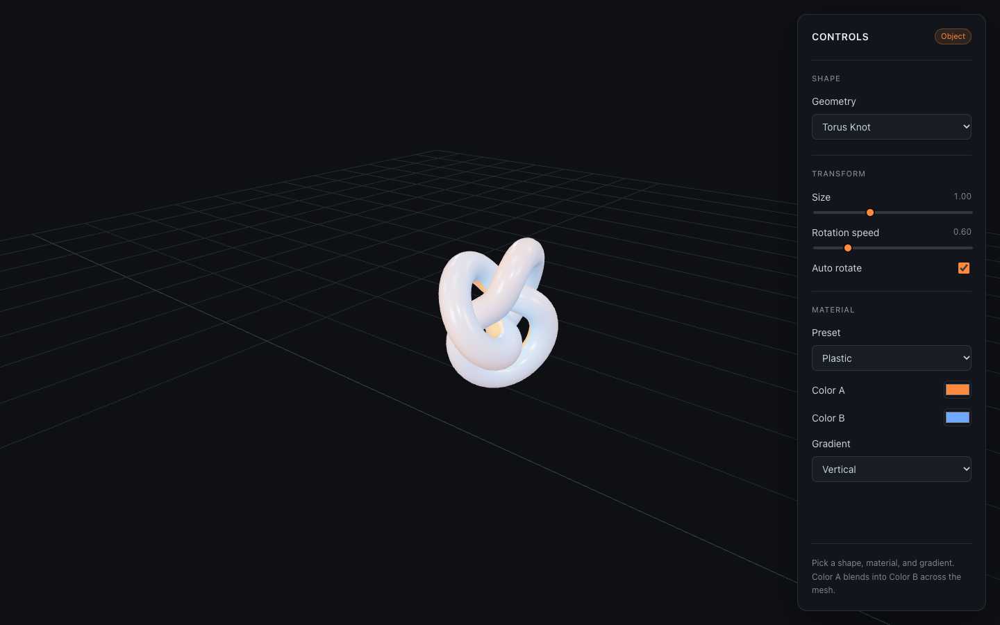

# Week 1: Three.js Exploring

[← Class-notes index](README.md) · [← Main README](../../README.md)

Prototype tab: **Week 1 — Three.js exploring** · Code: [`Week1Scene.jsx`](../../react-practice/src/components/Week1Scene.jsx), [`SidePanel.jsx`](../../react-practice/src/components/SidePanel.jsx)

## What I Built

An interactive 3D viewer for one object. You can change the object's shape, size, rotation, material, and two-colour gradient, and orbit around it with the mouse. This was the Class 02 exercise (September 2), and it is the base every later tab builds on.

### Class exercise checklist

| Requirement | How it is done | Status |
| --- | --- | --- |
| Interactive Three.js canvas | `WebGLRenderer` inside a React component that resizes with the window | Done |
| Sample geometry | Eight built-in shapes, from box to torus knot | Done |
| Orbit camera | `OrbitControls` with damping, zoom limited to 2–30 units | Done |
| A light | Ambient light, a warm key light, and a blue rim light | Done |
| Material colours and types | Seven material presets and a two-colour gradient | Done |
| World grid that fades with distance | A 24 × 24 `GridHelper` below the object | **Grid only — it does not fade yet** |
| Scene background colour | Dark `#0e1014` | Done |

## How the Scene Works

- **Camera:** a perspective camera (50° field of view) placed above and to the side of the object.
- **Renderer:** ACES filmic tone mapping (exposure 1.15) so bright highlights roll off softly instead of clipping.
- **Environment reflections:** a generated room environment (`RoomEnvironment` + `PMREMGenerator`) gives metal and glossy materials something to reflect. Without it, metal looks black.
- **Lights:** a soft ambient fill (0.25), a white key light from the upper front (2.4), and a blue rim light from behind (1.4) that outlines the silhouette.
- **Procedural textures:** the normal maps (surface bumps) and roughness maps are drawn in code on a canvas: random grain for matte, fine lines for brushed metal, and small dots for rubber. No image files are used.

## Parameters

### Shape

| Control | Meaning |
| --- | --- |
| **Geometry** | Which mesh to show: Box, Sphere, Cylinder, Cone, Torus, Octahedron, Dodecahedron, or Torus Knot. |

### Transform

| Control | Range (default) | Meaning |
| --- | --- | --- |
| **Size** | 0.2–2.5 (1) | Uniform scale of the object. |
| **Rotation speed** | 0–3 (0.6) | Spin speed in radians per second around the vertical axis. The object also tilts at 35% of this speed so every side is shown. |
| **Auto rotate** | on / off (on) | Pauses or resumes the spin. |

### Material

| Control | Meaning |
| --- | --- |
| **Preset** | A physically based material setting (see the table below). |
| **Color A / Color B** | The two ends of the gradient painted on the object. |
| **Gradient** | Direction of the blend: Vertical, Horizontal, Diagonal, or Radial. The gradient is a texture, so it follows each shape's UV layout; on a sphere, "vertical" runs pole to pole. |

What each preset changes:

| Preset | Roughness | Metalness | Reflection strength | Surface detail |
| --- | --- | --- | --- | --- |
| Matte | 1.0 | 0 | 0.15 | Visible grain |
| Plastic | 0.4 | 0 | 0.55 | Smooth |
| Metal | 0.28 | 1 | 1.35 | Fine lines |
| Brushed Metal | 0.48 | 1 | 1.15 | Strong brushed lines |
| Chrome | 0.04 | 1 | 1.8 | Mirror-smooth |
| Rubber | 0.95 | 0 | 0.1 | Bumpy dots |
| Ceramic | 0.16 | 0.05 | 0.85 | Faint grain |

- **Roughness:** 0 is a sharp mirror reflection; 1 scatters light so the surface looks dull.
- **Metalness:** 0 is a non-metal (plastic, stone, wood); 1 is a metal whose colour comes from its reflections.
- **Reflection strength** (`envMapIntensity`): how strongly the environment shows in the surface.
- **Surface detail** (normal-map strength): how bumpy the lighting looks, without changing the actual shape.

## Why I Built This

- **Learn the rendering pipeline.** Every procedural world still needs a scene, a camera, a renderer, lights, and materials. This tab isolates those pieces on one object.
- **Understand materials before terrain.** Roughness and metalness decide whether a surface reads as bark, wet moss, stone, or glass. The ant's forest floor will need all of these.
- **Reusable setup.** The orbit camera, resize handling, and lighting pattern are reused in Weeks 2–5.
- **First procedural step.** The textures are generated by code, not loaded from images, which is the same idea the later terrain is built on.

## Limitations and Next Steps

- The grid does not fade with distance yet. Adding scene fog, or a grid shader that fades by camera distance, would complete the exercise.
- The procedural textures use `Math.random()`, so they change on each reload. A seeded random function (as used from Week 2 on) would make them reproducible.
- Only one object is shown; there is no scene composition yet.
