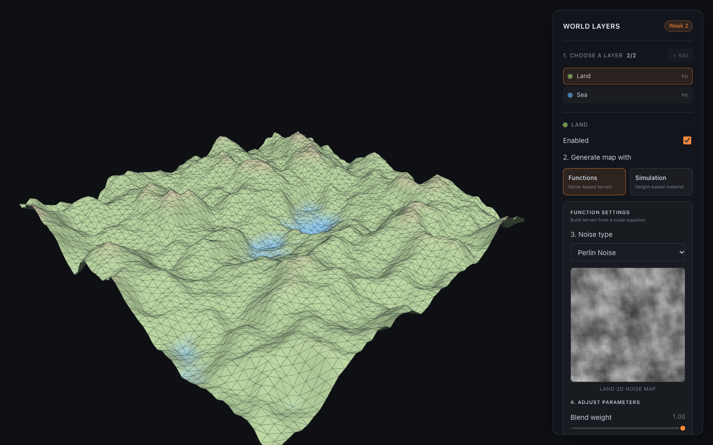

# Week 2: Infinite Noise Map

[← Class-notes index](README.md) · [← Main README](../../README.md)

Prototype tab: **Week 2 — Infinite Noise Map** · Code: [`Week2Scene.jsx`](../../react-practice/src/components/Week2Scene.jsx), [`NoiseTerrain.jsx`](../../react-practice/src/components/NoiseTerrain.jsx), [`utils/noise.js`](../../react-practice/src/utils/noise.js), [`utils/earthLayers.js`](../../react-practice/src/utils/earthLayers.js), [`utils/heightMaterial.js`](../../react-practice/src/utils/heightMaterial.js)

## What I Built

A terrain generated entirely from noise functions. Two **earth layers**, Land and Sea, each produce a noise pattern; the patterns are blended and turned into a 3D height map coloured from sea to snow. The map is **infinite**: moving with W A S D samples a new part of the same noise, so the world continues forever and looks the same every time you return to a spot.

The panel follows a four-step workflow:

1. **Choose a layer** (Land or Sea).
2. **Generate the map with** *Functions* (noise) or *Simulation* (an animated overlay).
3. **Pick a noise type** or a simulation shader.
4. **Adjust the parameters.**

Two small previews show the selected layer's noise and the combined blend.

## Key Ideas

- **Noise function:** a function that returns a smooth pseudo-random value for any (x, y). Because it is a function of the coordinates, no terrain has to be stored.
- **Seed:** a number that picks which random pattern the function produces. The same seed always gives the same world.
- **Octaves (fBm):** several copies of the noise added together, each finer and weaker than the one before. The first octave shapes continents; later ones add hills and small bumps.
- **Height → colour:** each point's noise value (−1 to 1) becomes an elevation (0 to 1), which is used both as height and to pick a colour band.

## Parameters

### Layer controls

| Control | Range | Meaning |
| --- | --- | --- |
| **+ Add / Remove layer** | 1–2 layers | Adds the other preset layer or removes the selected one. At least one layer always remains. |
| **Enabled** | on / off | Includes or excludes this layer from the blend. |
| **Generate map with** | Functions / Simulation | *Functions* makes the layer contribute noise to the height. *Simulation* makes it an animated colour overlay instead. |

### Function settings (noise)

| Control | Range | Meaning |
| --- | --- | --- |
| **Noise type** | White / Perlin / Cellular | *White:* independent random values, pure static. *Perlin:* smooth, rolling gradients, natural for hills. *Cellular:* distance to the nearest random point, giving cell and basin shapes. |
| **Blend weight** | 0–1 | How much this layer counts in the weighted average of all enabled layers. |
| **Scale / frequency** | 0.002–0.04 | How zoomed-in the noise is. Lower values make larger, broader features. |
| **Octaves** | 1–8 | Number of detail layers added together. More octaves means more small-scale detail. |
| **Persistence** | 0.1–0.9 | How much weaker each octave is than the previous one. Higher values make rougher terrain. |
| **Lacunarity** | 1.2–4 | How much finer each octave is than the previous one (frequency multiplier). |
| **Seed** | 0–9999 | Which random pattern to use. The button next to it picks a random seed. |

Default layers:

| Layer | Type | Scale | Octaves | Persistence | Lacunarity | Seed | Weight |
| --- | --- | --- | --- | --- | --- | --- | --- |
| Land | Perlin | 0.009 | 5 | 0.52 | 2 | 42 | 1.0 |
| Sea | Cellular | 0.004 | 2 | 0.45 | 2 | 213 | 0.4 |

### Simulation settings

| Control | Range | Meaning |
| --- | --- | --- |
| **Material / shader** | Flood / Cloud / Rain | *Flood:* tints everything below a water line blue, with a soft shoreline. *Cloud:* whitens a band around 72% elevation, like low cloud on the hills. *Rain:* darkens low areas with a pulsing wetness. |
| **Shader strength** | 0–1 | How strong the overlay is. |
| **Start / Stop** | — | Animates the water level up and down on a sine wave. |
| **Water level** | 0.05–0.9 | Height of the water line; manual when the simulation is stopped. |

### Map navigation and view

| Control | Meaning |
| --- | --- |
| **W A S D / arrow keys** | Scroll across the infinite map. The coordinates show where you are. |
| **Reset position** | Return to the origin (0, 0). |
| **Wireframe** (key F) | Shows the triangle grid on top of the terrain. |

### Grid and shaping

| Control | Range | Meaning |
| --- | --- | --- |
| **Grid resolution** | 16–128 segments | How many vertices the 12 × 12 terrain plane has. More segments means more detail and more work. |
| **Shaping operation** | see below | Remaps the blended noise to create a different landform. |
| **Shaping strength** | 0–1 | How much of the shaping is applied. |

| Shaping operation | Effect |
| --- | --- |
| None | Raw blended noise. |
| Ridged | Folds the noise so zero-crossings become sharp ridges, like mountain chains. |
| Billow | Folds the other way into rounded, puffy hills. |
| Turbulence | Domain warp plus billow: swirling, eroded shapes. |
| Terracing | Snaps heights to 2–14 flat steps, like rice terraces or mesas. |
| Power curve | Flattens lowlands and sharpens peaks. |
| Domain warping | Offsets the sample position with another noise, bending landforms into organic shapes. |

### Height colour bands

| Elevation (0–1) | Colour |
| --- | --- |
| below 0.36 | Sea (Sea layer colour) |
| 0.36–0.44 | Shore blend: sea → land |
| 0.44–0.64 | Land (Land layer colour) |
| 0.64–0.74 | Land → brown terrain |
| 0.74–0.82 | Brown terrain |
| 0.82–0.96 | Terrain → rock → snow |
| above 0.96 | Snow |

## Why I Built This

- **Noise is the base of procedural worlds.** Almost every natural shape in the later tabs, including hills, bark, and foliage, starts from noise and octaves.
- **Seeds make the world reproducible.** The Project tab uses the same idea: one seed rebuilds the same three trees.
- **Layers are how a world is built up.** Blending separate Land and Sea layers shows how land layers and features are added one at a time, which was a presentation requirement.
- **Colour by height** is the first version of layer colouring. The Giant Tree City colours roots, trunk, branches, and canopy by height in the same way.

## Limitations and Next Steps

- A height map stores one height per (x, y), so it cannot make caves, overhangs, or hollow trunks. That limitation is why Week 3 moves to **3D density fields (voxels)**.
- At most two layers can be blended.
- The simulations are colour overlays only; the water does not change the terrain shape.
