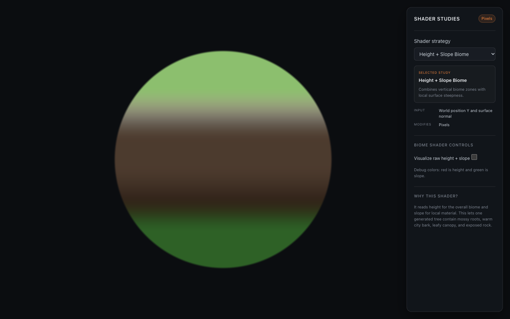

# Week 4: Shape Exploring — Shader Studies

[← Class-notes index](README.md) · [← Main README](../../README.md)

Prototype tab: **Week 4 — Shape exploring** · Code: [`Week4Scene.jsx`](../../react-practice/src/components/Week4Scene.jsx), [`ShaderStudyCanvas.jsx`](../../react-practice/src/components/ShaderStudyCanvas.jsx), [`shaders/`](../../react-practice/src/shaders/)

## What I Built

A set of **shader studies**: small GPU programs that decide the colour of each pixel, or the position of each vertex, on a round preview surface. Pick a **Shader strategy** from the menu; the panel then explains what the shader reads, what it changes, and why it is useful, and shows that shader's controls.

The studies are written directly in **WebGL and GLSL** instead of using three.js materials. Each one is a vertex shader plus a fragment shader drawn onto a full-screen preview (or, for vertex displacement, onto a grid mesh). Working at this lower level shows exactly what runs on the GPU.

| Study | Reads | Changes |
| --- | --- | --- |
| Default | nothing | nothing (neutral comparison) |
| Height Gradient | world height (Y) | pixel colour |
| Slope | surface normal | pixel colour |
| Height + Slope Biome | height and surface normal | pixel colour |
| Vertex Displacement | position and time | vertex positions |
| Fresnel Glow | surface normal and camera direction | pixel colour |
| Distance Fog | distance from the camera | pixel colour |
| Procedural Noise | position and time | pixel colour |

## Key Ideas

- **Vertex shader:** runs once per vertex and can move it. Used here for vertex displacement.
- **Fragment shader:** runs once per pixel and decides its colour. Used by every other study.
- **Uniforms:** values sent from the control panel to the shader each frame. Every slider below is a uniform.
- **`smoothstep` blending:** instead of hard colour edges, colours fade across a small range. Most "softness" and "smoothness" controls widen or narrow that range.

## Parameters

### Height Gradient

Colours the tree from roots to canopy using height: **roots → moss and lower trunk → middle trunk city → branches → canopy**.

| Control | Range (default) | Meaning |
| --- | --- | --- |
| **Gradient intensity** | 0–1 (1) | How strongly the zone colours are applied. |
| **Transition smoothness** | 0–1 (0.45) | How gradually one zone fades into the next. 0 gives sharp bands. |
| **Minimum height** | −50–80 (−20) | Height where the root colour starts. |
| **Maximum height** | 0–150 (100) | Height where the canopy colour ends. |

### Slope

Uses how steep the surface is: **flat → moss and vegetation, medium → earthy slopes, steep → rock and bark**.

| Control | Range (default) | Meaning |
| --- | --- | --- |
| **Slope threshold 1** | 0.05–0.75 (0.28) | Steepness where flat vegetation turns into earth. |
| **Slope threshold 2** | 0.25–0.95 (0.62) | Steepness where earth turns into rock and bark. |
| **Transition softness** | 0.01–0.25 (0.1) | How wide the blend between zones is. |

### Height + Slope Biome

Combines both: height picks the zone (low, middle, high) and slope picks the material inside it, giving six materials: mossy / dark roots, warm / grey trunk, and leafy / pale canopy.

| Control | Default | Meaning |
| --- | --- | --- |
| **Visualize raw height + slope** | off | Shows the raw inputs instead of the biome: **red = height, green = slope**. Useful to check what the shader actually reads. |

### Vertex Displacement

Moves vertices with noise over time. The movement grows toward the top, so the roots stay still while the canopy sways.

| Control | Range (default) | Meaning |
| --- | --- | --- |
| **Displacement strength** | 0–0.15 (0.06) | How far vertices move. |
| **Animation speed** | 0–2 (0.65) | How fast the movement changes. |
| **Noise scale** | 0.5–6 (2.4) | Size of the movement pattern. Higher values give smaller, busier waves. |
| **Pause animation** | off | Freezes time to inspect one frame. |

### Fresnel Glow

Makes edges that face away from the camera glow, like light catching the rim of leaves.

| Control | Range (default) | Meaning |
| --- | --- | --- |
| **Fresnel power** | 1–8 (3) | How thin the glow is. Higher values push it closer to the silhouette. |
| **Glow intensity** | 0–2 (0.75) | Brightness of the glow. |
| **Glow color** | (`#a8e5dc`) | Colour of the rim light. |

### Distance Fog

Fades far surfaces into fog to create depth and a humid atmosphere.

| Control | Range (default) | Meaning |
| --- | --- | --- |
| **Fog start distance** | 0–30 (5) | Distance where fog begins. |
| **Fog end distance** | 5–50 (28) | Distance where fog reaches full strength. |
| **Fog density** | 0–1 (0.82) | Maximum amount of fog. |
| **Fog color** | (`#86c7c1`) | Blue-green fog colour. |

### Procedural Noise

Adds organic colour variation without any image textures.

| Control | Range (default) | Meaning |
| --- | --- | --- |
| **Noise scale** | 1–12 (5) | Size of the pattern. Higher values give finer grain. |
| **Noise strength** | 0–0.5 (0.22) | How much the colour varies. |
| **Noise contrast** | 0.5–3 (1.35) | Pushes the variation toward light and dark. |
| **Animation speed** | 0–2 (0) | 0 is static; higher values make the pattern drift. |

## Why I Built This

- **Separate the layers without changing geometry.** The concept needs roots, trunk, branches, and canopy to read as different places. Shaders can do that with colour, light, and fog alone.
- **Understand what each effect reads.** Studying one effect at a time (height, slope, camera distance, time) makes it clear which data each effect needs from the world.
- **Test the atmosphere.** Fog, glow, and swaying canopy test the "different climate at different heights" part of the concept before the world is built.
- **Direct path to the project.** The ant world reuses these ideas: height and moisture colouring for dry ridges and damp hollows, slope to keep moss off steep faces, and distance fog to hide the edge of the streamed world.

## Limitations and Next Steps

- The studies run on a round stand-in preview surface, not on the real terrain.
- Each study runs alone; they are not yet combined into one material.
- Next: port the height, slope, and fog shaders into the ant world's height-field terrain material.
