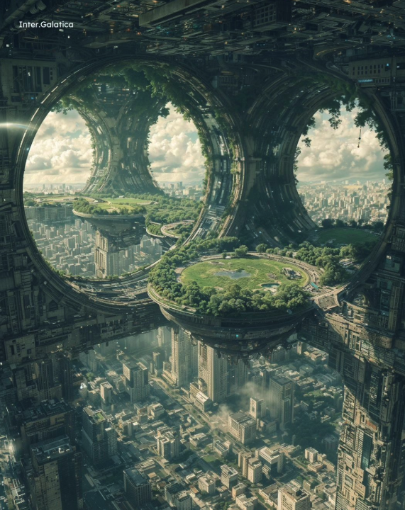
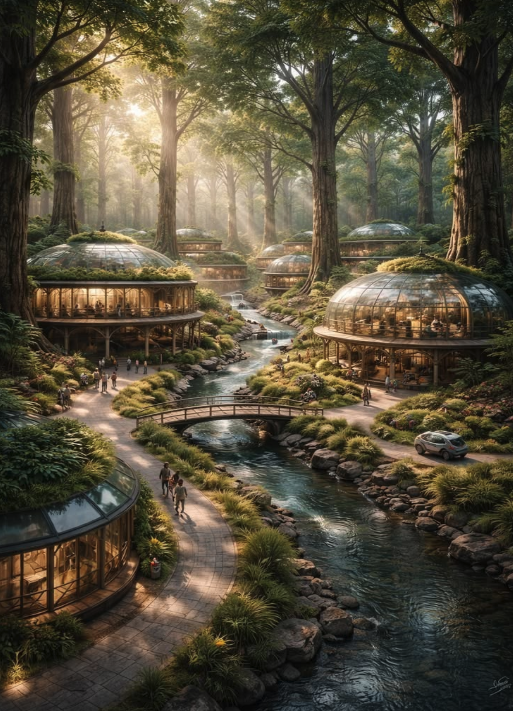
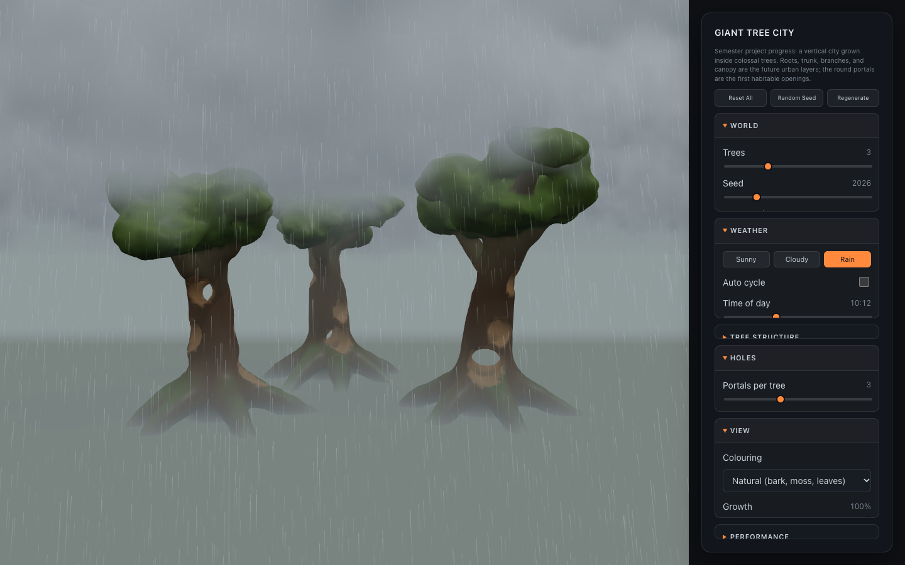
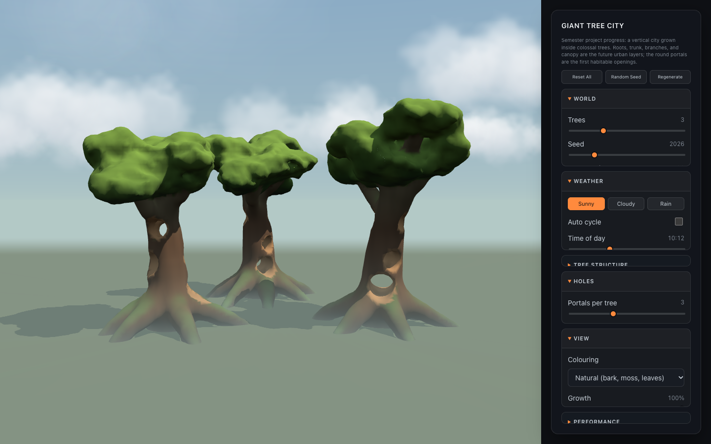
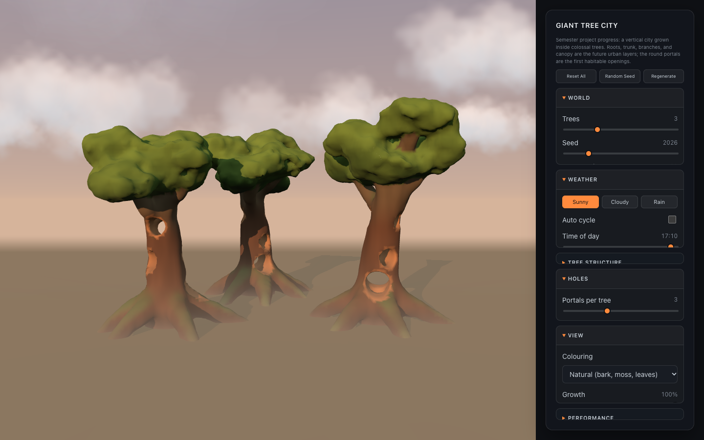

# Project Design — A City Built Inside Giant Trees

[← Planning index](README.md) · [← Main README](../../README.md)

## Concept

| City inside the trunk | Village among the roots |
| --- | --- |
|  |  |
| Round portals open the trunk to the sky; platforms and parks hang inside the hollow — the model for the **trunk / industrial district** and the portals in the Project tab. | Domed homes, footpaths, and a river at the base of the trees — the mood for the **root-level underground city** and the ground layer. |

*Concept reference images from a mood board (third-party artwork, not my own), used for inspiration.*

A City Built Inside Giant Trees  
Several impossibly large trees contain an entire world. Different parts of the trees become different urban layers: roots form underground cities, trunks contain dense industrial districts, branches support villages, and the canopy reaches into a completely different climate.

## Why I chose this concept

I wanted to build a world that feels both natural and architectural. A giant tree gives me a clear vertical structure, but each layer can still have its own environment, culture, and atmosphere. It also lets me experiment with scale, exploration, and environmental transitions instead of creating just one flat landscape.

## Techniques I can use

- Voxels: build the main terrain, giant tree forms, caves, and layered environments.
- Noise: use Perlin or Cellular Noise to create irregular roots, bark, terrain, cliffs, and organic shapes.
- Procedural generation: generate branches, roots, villages, and environmental details with controlled randomness.
- Seed + deterministic generation: recreate the same world while testing different parameters.
- Meshing: convert voxel structures into smoother 3D surfaces.
- Different resolutions: use larger voxels for the overall tree structure and finer detail for villages or interiors.
- Shaders / atmosphere: create fog, rain, light, moisture, and different climates at different heights.

## Project Progress Tab — Giant Tree World

The **Project** tab in the web prototype is the first working version of this concept: a forest of 1–8 giant trees (the user chooses; default 3), each complete from root to canopy, with holes carved into every trunk. Full write-up, screenshots, and measurements: [Project Progress 01](../class-notes/project-01-giant-trees.md).


### Techniques used

| Technique | How it is used in the tab |
| --- | --- |
| **Signed distance fields (voxel density)** | Each tree is a set of simple shapes (tapered tubes and squashed spheres). The density at any point is the negative distance to the tree surface: positive means wood, negative means air. |
| **Procedural generation** | Roots arch out and dive into the ground. The trunk leans and wobbles. Branches curl upward, each with one fork. Foliage pads cluster at branch tips and the crown. |
| **Seed + deterministic generation** | One world seed gives each tree its own seed, so the trees differ, but the same seed always rebuilds the same world. The **Trees** slider sets how many grow: one stands in the centre, two to five form a ring that widens to keep a constant gap, and six or more add a centre tree inside the ring. |
| **CSG** | Segments of one root or branch join with a hard minimum. Separate roots and branches are **smooth-unioned** into the trunk, which creates the flared buttresses. **Portals** (round tunnels) and an optional **hollow core** are subtracted last. |
| **Noise** | 3D value noise adds vertical bark ridges and broad lumps (outward only, so walls never thin). Stronger fBm makes the canopy pads look leafy. |
| **Meshing** | Marching Cubes turns the density field into a smooth triangle surface. Round portals need this; blocky voxels would lose their shape. |
| **Chunking + multi-resolution** | The world is split into 16³-cell chunks. Chunks no shape can reach are skipped, and each chunk evaluates only nearby shapes. Low / Medium / High presets change the cell size (1.6 / 1.1 / 0.8 m). |
| **Shaders & fog** | Vertex colours separate damp roots, bark, moss, leaves, and warm heartwood inside the holes. A height-fog shader patch makes the ground misty and the canopy clear, so each layer reads as its own climate. |
| **Weather** | Sunny / Cloudy / Rain presets and a time-of-day sun. A shader sky dome, drifting cloud puffs, and 40,000 GPU raindrops. Rain wets the bark, and the cloud base drops so the treetops reach into the clouds while the roots sit in mist. See [Weather](../class-notes/project-01-giant-trees.md#weather). |



### System structure

```text
ProjectScene.jsx  (React UI + Three.js scene)
  │  parameters: seed, tree shape, holes, resolution
  ▼
giantTreeWorker.js  (Web Worker, off the main thread)
  │
  ├─ giantTrees.js  createWorldBlueprint()  → 1–8 trees as primitive lists
  │                 planChunks()            → chunks near a tree, bottom to top
  │                 sampleRegionDensity()   → density = SDF + CSG + noise
  │                 colorChunkVertices()    → natural + city-layer colours
  │
  ├─ chunkMesher.js sampleChunkField()      → padded density grid per chunk
  │                 polygonizeChunk()       → Marching Cubes triangles
  │
  └─ noise3d.js     valueNoise3D / fbm3D / seeded random
  │
  │  streams finished chunks back in batches
  ▼
ProjectScene.jsx  → one mesh per chunk, shadows, height fog, growth clip

Every frame, in the render loop (no regeneration):
  weatherState.js  target weather → eased live weather → sun, sky, fog, wetness
  sky.js           sky dome + sun glow
  clouds.js        drifting, depth-sorted cloud puffs
  rain.js          GPU-animated raindrops around the camera
```

- **UI layer:** `ProjectScene.jsx` owns the scene, camera, lights, ground, fog, and control panel. Changing a shape parameter restarts the worker; view settings such as colouring, fog, wireframe, chunk bounds, and growth update instantly without regenerating.
- **Generation layer:** the worker builds the blueprint, plans the chunks, and meshes them one by one. Chunks come back bottom to top, so the trees visibly grow from the roots while generating.
- **Geometry layer:** `giantTrees.js` holds all tree rules and the density function. `chunkMesher.js` is a general-purpose Marching Cubes mesher. It samples one extra ring of points around each chunk, so neighbouring chunks meet without cracks.
- **Weather layer:** the `weather/` modules run inside the render loop and only change light and atmosphere, so changing the weather never regenerates the trees.

### Weather techniques

| Sunny, 10:12 | Sunset, 17:10 |
| --- | --- |
|  |  |

Six techniques make up the weather: one blending system that drives everything, then one technique each for the sun, sky, clouds, rain, and wet surfaces.

| # | Part | Technique | What it does |
| --- | --- | --- | --- |
| 1 | **Blending** (`weatherState.js`) | **Target → live weather with exponential smoothing**: `live += (target − live) × (1 − e^(−dt / time))` | The panel sets a target; every frame the live weather moves toward it, so Sunny → Rain fades over about 3 s. Wetness has its own speeds: wet in about 2.5 s, dry over about 9 s. |
| 2 | **Sun** | **Time of day → sun angles** (sine-curve elevation up to 64° plus a compass direction) | The shadow-casting sun rises in the east, peaks at noon, and sets in the west. Its colour moves from white to orange near the horizon. Clouds and rain dim it while a hemisphere sky light brightens, giving soft shadows on grey days. |
| 3 | **Sky** (`sky.js`) | **Sky dome with a custom fragment shader** | An inside-out sphere that follows the camera. Each pixel is coloured by viewing height (horizon → zenith), plus a sun disc and glow that fade behind clouds. The fog uses the horizon colour, so the ground melts into the sky. |
| 4 | **Clouds** (`clouds.js`) | **Instanced billboards, noise edges, threshold fading, depth sorting** | 56 clusters × 7 puffs (392) drawn in one GPU call. A vertex shader turns each puff to face the camera. 2D noise makes fluffy edges, lit on top and shaded below. Each cluster fades in once cloud cover passes its random threshold. Puffs drift and wrap with the wind and are sorted back to front each frame. |
| 5 | **Rain** (`rain.js`) | **GPU particle system** | 40,000 streaks. Each drop gets a random start once; the vertex shader moves it (`start + velocity × time`) and wraps it with `mod()` inside a box that follows the camera. JavaScript only updates a few uniforms per frame. Wind slants the streaks and drops fade with distance. |
| 6 | **Wet surfaces** | **Shader injection into the standard material** | The same patch that adds height fog uses a `uWetness` value to darken colour and lower roughness, so bark and ground look wet. Rain also pulls the fog in and thickens the ground mist. |

**How it serves the concept.** The cloud base lowers as cover grows (from 1.4 to 1.12 × tree height), so in rain the treetops reach into the clouds while the roots sit in damp mist. Each layer of the tree visibly has its own climate.

**How it builds on earlier weeks.**

- **Noise** (Week 2) shapes the cloud edges.
- **Shaders and fog** (Week 4) power the sky, rain, and wetness.
- **Seeds** fix the cloud layout.

**One-sentence version:** *The weather is one eased set of parameters that drives a moving sun, a shader sky dome, instanced noise-textured cloud billboards, and 40,000 GPU-animated raindrops. Rain also wets the bark and lowers the cloud base, so each layer of the tree has its own climate.*

Full parameter reference and screenshots: [Weather](../class-notes/project-01-giant-trees.md#weather).

### How the tab maps to the urban layers

| Tree part | Future city layer | Shown in the tab as |
| --- | --- | --- |
| Roots | Underground city | Dark, damp root colouring; blue in the city-layer view |
| Trunk + portals | Industrial district | Hollow trunk with round portals; warm heartwood walls |
| Branches | Villages | Lighter, mossy limbs; yellow in the city-layer view |
| Canopy | Different climate zone | Foliage pads above the fog line |

### Next steps

- Platforms, floors, and bridges inside the portals — the first city geometry.
- Lights on the heartwood walls so the interiors read as inhabited.
- Different interiors per layer (root halls, trunk shafts, branch villages).
- Save/load tree worlds with Firebase.
- Terrain and rivers around the roots instead of a flat ground.
