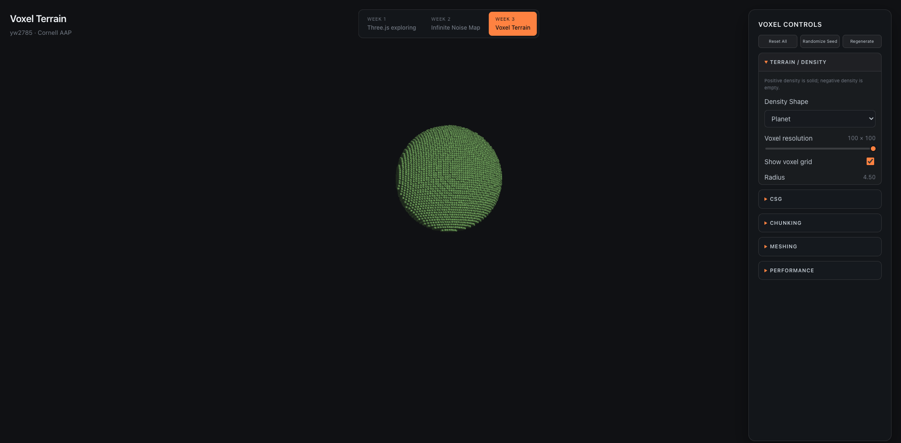

# Procedural World Building Web Prototype

[← Main study notebook](../README.md)

An interactive React, Vite, and Three.js prototype for studying procedural world-building systems.



## Prototype Areas

| Tab | Topics |
| --- | --- |
| Week 1 — Three.js Exploring | Scene setup, primitive geometry, lighting, materials, OrbitControls, fading grid |
| Week 2 — Infinite Noise Map | Seeded noise, layered terrain, map controls, terrain materials |
| Week 3 — Voxel Terrain | Density fields, cubic voxels, sequential CSG, chunking, Marching Cubes, optimization |
| Week 4 — Shape Exploring | Eight comparable shader modes using position, normals, time, view direction, distance, and noise |

## Setup

```bash
npm install
cp .env.example .env.local
npm run dev
```

Fill `.env.local` with the Firebase web-app configuration described in the [Firebase setup tutorial](../docs/tutorials/Firebase%20setup.md). The file is ignored by Git.

## Available Commands

```bash
npm run dev      # start the local development server
npm run lint     # check the JavaScript and JSX
npm run build    # create a production build
npm run preview  # preview the production build locally
```

## Source Structure

```text
src/
├── components/       # Week scenes, controls, and previews
├── lib/firebase.js   # Firebase and Firestore initialization only
├── shaders/          # Independent GLSL studies and shared WebGL helpers
├── utils/            # Noise, density, terrain, and material utilities
├── App.jsx           # Week-tab navigation
├── App.css           # Application and control-panel layout
└── main.jsx          # React entry point
```

## Firebase Boundary

The Week 3 panel includes a **Save World** / **Load Selected** integration. Firestore stores the world name, seed, density and noise parameters, voxel resolution, ordered CSG operations, chunking settings, meshing settings, and timestamps. Loading applies those parameters to the existing controls so the world regenerates locally.

Generated voxel arrays and mesh geometry are never uploaded. Firestore rules must permit the `worlds` collection before the controls can access the live database.

## Assignment 2 — Shader Studies

Week 4 compares Default, Height Gradient, Slope, Height + Slope Biome, Vertex Displacement, Fresnel Glow, Distance Fog, and Procedural Noise. Each mode exposes only its relevant controls and explains its inputs, shader stage, visual result, and use in the ant micro world. Shader programs and preview buffers are created once and reused when modes change.

## Related Notes

- [Class 04 voxel terrain study](../docs/class-notes/week-3-voxel-terrain.md)
- [Project design](../docs/planning/project-design.md)
- [Feature backlog](../docs/planning/backlog.md)
